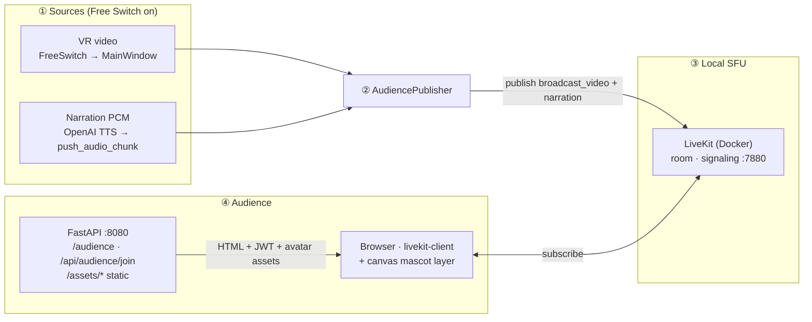
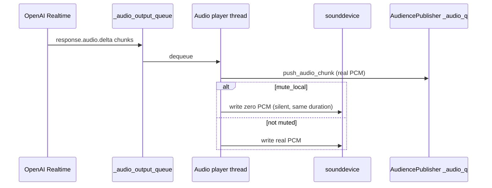

# Audience second screen (LiveKit)

This package implements a **second display** for viewers: they open a browser page and receive **video** (LiveKit track `broadcast_video`) plus **TTS narration** (`narration`) over WebRTC. **`broadcast_video`** carries **only the VR / OBS feed** (no mascot burned in): `AudiencePublisher` scales to **`1920×1080`** when `VIDEO_W`/`VIDEO_H` match and the capture pipeline delivers that resolution. The **mascot / anchor character** is drawn **in the browser** (`static/index.html`): a hidden MP4 is chroma-keyed on a `<canvas>` (auto backdrop colour from the frame border) and an optional mouth PNG follows `narration` volume—**not** via OpenCV in Python. The **control GUI (first screen)** continues to show whichever source the operator selects in **Free Switch**; **no narration is meant to play on the first screen** when the audience pipeline is active (`mute_local=True`).

| Topic | Behavior |
|-------|----------|
| **Video** | Native-resolution VR from `FreeSwitchCameraThread` via `signal_vr_frame` (typically **1920×1080**; driver may snap to another mode) |
| **Audio** | TTS PCM → local LiveKit room directly (`_audio_pump_direct`) |
| **Mascot** | **Viewer only:** `index.html` loads `/assets/avatar/…` (served by `token_server`); canvas chroma + optional `overlay_config.json` overrides—no extra load on `livekit_publisher`. |

**Note:** `signal_frame` still uses **640×480** / **1280×480** for LiveCC; only the audience branch uses full-res VR. Higher video resolution increases **encode bandwidth** and **CPU/GPU** load on the publisher machine.

Full integration points live in [gui.py](../gui.py) (`_ensure_audience_token_server`, `_start_audience_services`, `_deliver_audience_vr_frame`). For input workers and frame contracts, see [workers/README.md](../workers/README.md).

---

## When it runs

| Condition | Behavior |
|-----------|----------|
| `audience.enabled: true` in [configs/app.yml](../../../configs/app.yml) | HTTP token server may start with the GUI (`GET /audience`, `POST /api/audience/join`). |
| Operator chooses **Online ▾ → Free Switch** | **LiveKit publisher** starts: publishes `broadcast_video` + `narration`. |
| Operator leaves Free Switch / switches mode | Publisher stops; HTTP server keeps running until the app exits (if enabled). |

---

## End-to-end flow



**CPU / threading (publisher):** OpenCV (`cv2`) resize and RGBA packing for **VR only** run off the asyncio loop via `loop.run_in_executor(self._vr_executor, …)` with a **`ThreadPoolExecutor`** (`_vr_executor`, two workers). **Mascot** decoding and chroma run in the **viewer’s browser** (main thread + `requestAnimationFrame`).

---

## Browser mascot overlay (`static/index.html`)

| Item | Detail |
|------|--------|
| **Video source** | `<video id="avatar-src" src="/assets/avatar/<file>.mp4">` — replace the file name in HTML when you swap the clip; keep a **flat, even backdrop** and the subject away from the frame edges so border sampling stays clean. |
| **Keying** | Each decoded frame is drawn to a fixed-size `<canvas>`; **backdrop RGB** and a **spherical radius** are estimated once per load from a **border band** of pixels, then pixels inside the sphere (and not “colourful” enough) go transparent. **High-saturation** pixels are always treated as foreground to protect fur / clothing when you change backdrop colour. |
| **Mouth** | Optional PNG (`cat_mouth_opened.png`) opacity follows **RMS** on the subscribed `narration` track via Web Audio `AnalyserNode`. |
| **Playback** | While speech energy is detected: mascot MP4 **plays** (`loop`); when silent: **pause** (timeline preserved). |
| **Tuning** | Copy [`assets/avatar/overlay_config.example.json`](../../../assets/avatar/overlay_config.example.json) to **`assets/avatar/overlay_config.json`** (optional, not required in git) to override `foregroundSatMin`, `backdropRadiusBias`, `backdropRadiusClamp`. |

**Not supported here:** server-side (Python) compositing of the mascot into `broadcast_video`—that path was removed to keep encoder CPU predictable.

---

### TTS path (why it matches first-screen timing)

PCM still flows through a **single** `_audio_output_queue`. The player thread forwards each chunk to `push_audio_chunk` **and**, when `mute_local=True`, feeds **silence** to the local audio device so **hardware playback timing** stays aligned with unmuted mode. That keeps the LiveKit audio stream paced like normal local playback (see [openai_tts.py](../core/models/openai_tts.py)).

**Utterance queueing:** the Realtime worker does **not** send `response.cancel` when a new segment arrives while audio is still playing. The next line waits until `response.done` / `response.cancelled`, so one sentence finishes before the next starts. New text still replaces any **pending** lines not yet sent to the API (`enqueue_tts_text(..., drop_outdated=True)` clears the text queue). Hard **Stop** / `interrupt_tts` still cancels and flushes.



---

## Components

| Path | Role |
|------|------|
| [token_server.py](token_server.py) | FastAPI + uvicorn on `0.0.0.0`; serves viewer HTML, subscribe-only JWTs, and **`/assets/*`** (project `assets/` root for mascot files). |
| [static/index.html](static/index.html) | LiveKit JS viewer: subscribes to `broadcast_video` + `narration`; **canvas chroma mascot** + optional mouth overlay (see section above). |
| [livekit_publisher.py](livekit_publisher.py) | Background asyncio thread: publishes **`1920×1080`** `broadcast_video` (**VR only**, resize + RGBA pack), **30 fps** pacing; **cv2** on **`_vr_executor`**—**no** mascot compositing. |
| [assets/avatar/](../../../assets/avatar/) | Mascot MP4 + optional mouth PNG; optional **`overlay_config.json`** (see example). |
| [gui.py](../gui.py) | Starts token server and `AudiencePublisher` when Free Switch runs with `audience.enabled`. |
| [openai_tts.py](../core/models/openai_tts.py) | `register_pcm_sink`, `clear_audio_queue` + optional `flush_callback` for LiveKit backlog. |
| [workers/free_switch.py](../workers/free_switch.py) | Emits **`signal_vr_frame`** (native VR, audience) alongside **`signal_frame`** (LiveCC-resolution active view). |
| [docker-compose.yml](../../../docker-compose.yml) | Local LiveKit container; map signaling + UDP ports. |
| [livekit.yaml](../../../livekit.yaml) | LiveKit server config (keys, RTC port range). |
| [scripts/open-audience-firewall.ps1](../../../scripts/open-audience-firewall.ps1) | Windows inbound rules for LAN viewers (run elevated). |

---

## Setup (local)

1. **LiveKit** (from repo root):

   ```bash
   docker compose up -d
   ```

2. **Align URLs for your LAN** (same host in all three places):

   - `configs/app.yml` → `audience.livekit_url` (e.g. `ws://<PC_LAN_IP>:7880`)
   - `docker-compose.yml` → `--node-ip <PC_LAN_IP>` (ICE must advertise a reachable IP)
   - Optional: pass `lan_hint_host=` into `AudienceTokenServer` from config if your `gui.py` is wired for it (prints a same-Wi-Fi URL in the console).

3. **Firewall** (other devices on Wi‑Fi): run `scripts/open-audience-firewall.ps1` **as Administrator** once, or manually allow TCP **8080, 7880, 7881** and UDP **50000–50020**.

4. **GUI**:

   ```bash
   python -m miis_broadcast
   ```

5. **Operator**: **Free Switch** → wait for **`[MEDIA] connected`** in the terminal → viewers open `http://<PC_LAN_IP>:8080/audience` (or `localhost` on the same machine).

---

## Configuration reference ([configs/app.yml](../../../configs/app.yml))

### `audience` section

| Key | Meaning |
|-----|---------|
| `audience.enabled` | Master switch for the feature. |
| `audience.livekit_url` | WebSocket URL passed to the browser (`ws://…:7880`). |
| `audience.api_key` / `api_secret` | Must match `livekit.yaml` `keys` (secret ≥ 32 chars on recent LiveKit). |
| `audience.room` | LiveKit room name (publisher + viewers join the same room). |
| `audience.port` | HTTP port for `/audience`, `/api/audience/join`, and static **`/assets/*`** (mascot files; default **8080**). |

---

## Client terminal log reference (prefixes)

These lines appear on **`python -m miis_broadcast`** stdout (not the browser). They are **separate** from session files under `logs/sessions/` and from server `[Server]` / `[Client]` telemetry in remote inference.

**`[MEDIA]`** means the **local audience** LiveKit path (video → `broadcast_video`, session connect/disconnect). **`[AUDIO]`** means the **`narration`** track and the TTS → publisher PCM pipeline stats.

### `[AUDIENCE]` — HTTP token server

| Example | Meaning |
|---------|---------|
| `[AUDIENCE] token server started → http://localhost:8080/audience` | Uvicorn bound; local viewer URL. |
| `[AUDIENCE] same-WiFi URL → http://…:8080/audience` | Printed when a LAN hint host is configured. |
| `[AUDIENCE] if other devices cannot open…` | Reminder about Windows firewall. |
| `[AUDIENCE] join id=audience-… room=broadcast-room` | A viewer called `POST /api/audience/join`; JWT issued. |
| `[AUDIENCE] token server stopped` | App shutdown or server torn down. |
| `[ERR] [AUDIENCE] token server bind failed …` | Port in use or permission issue. |

### `[MEDIA]` — LiveKit publisher (video + session)

| Example | Meaning |
|---------|---------|
| `[MEDIA] publisher starting \| room=… mode=vr` | `AudiencePublisher.start()`. |
| `[MEDIA] connected \| room=…` | Local room connected. |
| `[MEDIA] publish_start track=broadcast_video (vr mode)` | Video track published. |
| `[MEDIA] fps=29.0 drop=0` | Video pump stats; `drop` = `_video_q` depth. |
| `[MEDIA] disconnected from LiveKit` | Clean disconnect. |
| `[MEDIA] publisher stopped` | Thread joined after `stop()`. |
| `[WARN] [MEDIA] publisher thread hung; forcing event loop stop` | Graceful shutdown timed out. |
| `[ERR] publisher session (vr): …` | Python-side failure. |

### `[AUDIO]` — publisher narration track + PCM hook

| Example | Meaning |
|---------|---------|
| `[AUDIO] publish_start track=narration (vr mode)` | LiveKit audio track published. |
| `[AUDIO] chunks/s=4.0 sample_rate≈24000 aq=8` | Periodic audio pump stats; **`aq`** = `_audio_q` depth. |
| `[AUDIO] PCM sink registered \| mute_local=True` | From [openai_tts.py](../core/models/openai_tts.py) when Free Switch registers the audience sink. |
| `[AUDIO] PCM sink cleared \| mute_local=False` | Publisher stopped / sink removed. |

### LiveKit **server** (Docker logs)

Rust lines such as `failed to negotiate the publisher` may appear in **`docker compose logs`** during bad ICE / reconnect races; they are **not** the Python `[MEDIA]` prefixes above. Correlate with publisher start/stop on the client.

---

## Troubleshooting (short)

| Symptom | Check |
|---------|--------|
| `ERR_CONNECTION_REFUSED` on `:8080` | GUI not running or `audience.enabled: false`. |
| `ERR_CONNECTION_REFUSED` on `:7880` | `docker compose up -d` and firewall. |
| Phone cannot connect | Same Wi‑Fi, correct LAN IP in `livekit_url` + `--node-ip`, firewall script. |
| Mascot holes / fringe after swapping MP4 | Re-open page; tweak `overlay_config.json` (`foregroundSatMin`, radius clamps). Prefer **flat single-colour** backdrop touching all four edges. |
| Overlapping audio in browser | Ensure a single `narration` element (see `index.html` dedupe by track name); avoid duplicate tabs both unmuted in the same room. |
| `[MEDIA] fps=…` not ~30 | Current build uses **deadline-based** pacing; sustained **~60+** may indicate an old build or clock skew. |
| Stutter with remote inference; server stdout shows `JPEG send_queue=30/30` | TCP/client cannot drain frames as fast as produced; often **high client RAM** or network. Root README → *Client send rate* / `_FRAME_QUEUE_MAX`. |
| `QThread: Destroyed while thread '' is still running` on exit | A background thread (e.g. publisher) may still be stopping; ensure Free Switch / audience teardown completes before closing the app window, or wait for `[MEDIA] publisher stopped`. |

---

## See also

- Root project overview: [README.md](../../../README.md)
- Input workers and `signal_vr_frame`: [workers/README.md](../workers/README.md)
