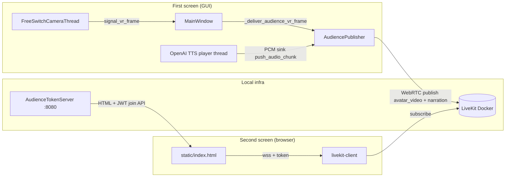
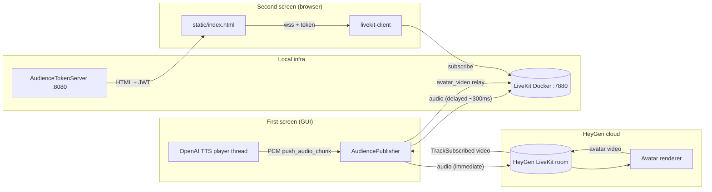
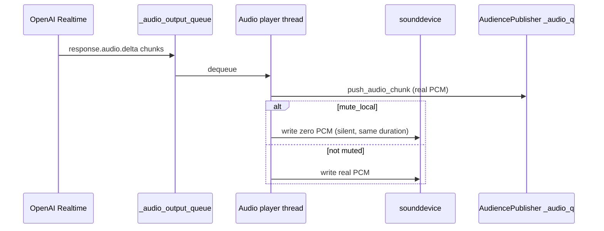

# Audience second screen (LiveKit)

This package implements a **second display** for viewers: they open a browser page and receive **avatar video** plus **TTS narration** over WebRTC (LiveKit). The **control GUI (first screen)** continues to show whichever source the operator selects in **Free Switch**; **no narration is meant to play on the first screen** when the audience pipeline is active (`mute_local=True`).

Two operating modes are supported (toggled by `configs/app.yml`):

| Mode | Video source | Audio path |
|------|-------------|------------|
| **VR mode** (default, `heygen.enabled: false`) | VR camera frames from `FreeSwitchCameraThread` | TTS PCM → local room directly |
| **HeyGen avatar mode** (`heygen.enabled: true`) | VR full screen + HeyGen avatar as **picture-in-picture** (bottom-right) | TTS PCM → HeyGen cloud (drives lip sync) **and** local room (delayed ~300 ms for A/V sync) |

Full integration points live in [gui.py](../gui.py) (`_ensure_audience_token_server`, `_start_audience_services`, `_deliver_audience_vr_frame`). For input workers and frame contracts, see [workers/README.md](../workers/README.md).

---

## When it runs

| Condition | Behavior |
|-----------|----------|
| `audience.enabled: true` in [configs/app.yml](../../../configs/app.yml) | HTTP token server may start with the GUI (`GET /audience`, `POST /api/audience/join`). |
| Operator chooses **Online ▾ → Free Switch** | **LiveKit publisher** starts: publishes `vr_program` (video) + `narration` (audio). |
| Operator leaves Free Switch / switches mode | Publisher stops; HTTP server keeps running until the app exits (if enabled). |

---

## End-to-end flow

### VR mode (default)



### HeyGen avatar mode



**Step-by-step (HeyGen mode)**

| Step | Component | Action |
|------|-----------|--------|
| 1 | Python backend | Calls OpenAI TTS API → PCM chunks |
| 2 | Python backend | Sends PCM to `heygen_room` (drives avatar mouth) |
| 3 | Python backend | Sends PCM to `local_room` with ~300 ms delay (audience hears speech after video arrives) |
| 4 | HeyGen cloud | Renders avatar video and streams back via `heygen_room` |
| 5 | Python backend | Subscribes to HeyGen video; composites **VR (full frame) + avatar (bottom-right PiP)**; publishes to local room |
| 6 | HTML frontend | Subscribes `avatar_video` + `narration` from `local_room` — video is the composited VR + avatar PiP |

### TTS path (why it matches first-screen timing)

PCM still flows through a **single** `_audio_output_queue`. The player thread forwards each chunk to `push_audio_chunk` **and**, when `mute_local=True`, feeds **silence** to the local audio device so **hardware playback timing** stays aligned with unmuted mode. That keeps the LiveKit audio stream paced like normal local playback (see [openai_tts.py](../core/models/openai_tts.py)).



---

## Components

| Path | Role |
|------|------|
| [token_server.py](token_server.py) | FastAPI + uvicorn on `0.0.0.0`; serves viewer HTML and short-lived subscribe-only JWTs. |
| [static/index.html](static/index.html) | LiveKit JS viewer: subscribe to `avatar_video` + `narration` (works for both modes). |
| [livekit_publisher.py](livekit_publisher.py) | Background asyncio thread: VR mode or HeyGen dual-room mode; audio delay relay. |
| [heygen_session.py](heygen_session.py) | HeyGen REST API: create/start/stop session, `interrupt()`, `send_silence()`. |
| [gui.py](../gui.py) | Reads `heygen` config block, builds `heygen_cfg` dict, passes to `AudiencePublisher`. |
| [openai_tts.py](../core/models/openai_tts.py) | `register_pcm_sink`, `clear_audio_queue` + optional `flush_callback` for LiveKit backlog. |
| [workers/free_switch.py](../workers/free_switch.py) | Emits **`signal_vr_frame`** (always VR) alongside **`signal_frame`** (active source). |
| [docker-compose.yml](../../../docker-compose.yml) | Local LiveKit container; map signaling + UDP ports. |
| [livekit.yaml](../../../livekit.yaml) | LiveKit server config (keys, RTC port range). |
| [scripts/open-audience-firewall.ps1](../../../scripts/open-audience-firewall.ps1) | Windows inbound rules for LAN viewers (run elevated). |

---

## Setup (local)

1. **LiveKit** (from repo root):

   ```bash
   docker compose up -d
   ```

2. **Align URLs for your LAN** (same host in all three places):

   - `configs/app.yml` → `audience.livekit_url` (e.g. `ws://<PC_LAN_IP>:7880`)
   - `docker-compose.yml` → `--node-ip <PC_LAN_IP>` (ICE must advertise a reachable IP)
   - Optional: pass `lan_hint_host=` into `AudienceTokenServer` from config if your `gui.py` is wired for it (prints a same-Wi-Fi URL in the console).

3. **Firewall** (other devices on Wi‑Fi): run `scripts/open-audience-firewall.ps1` **as Administrator** once, or manually allow TCP **8080, 7880, 7881** and UDP **50000–50020**.

4. **GUI**:

   ```bash
   python -m miis_broadcast
   ```

5. **Operator**: **Free Switch** → wait for `[MEDIA] connected` in the terminal → viewers open `http://<PC_LAN_IP>:8080/audience` (or `localhost` on the same machine).

---

## Configuration reference ([configs/app.yml](../../../configs/app.yml))

### `audience` section

| Key | Meaning |
|-----|---------|
| `audience.enabled` | Master switch for the feature. |
| `audience.livekit_url` | WebSocket URL passed to the browser (`ws://…:7880`). |
| `audience.api_key` / `api_secret` | Must match `livekit.yaml` `keys` (secret ≥ 32 chars on recent LiveKit). |
| `audience.room` | LiveKit room name (publisher + viewers join the same room). |
| `audience.port` | HTTP port for `/audience` and `/api/audience/join` (default **8080**). |

### `heygen` section

| Key | Default | Meaning |
|-----|---------|---------|
| `heygen.enabled` | `false` | Set `true` to activate HeyGen avatar mode. |
| `heygen.api_key` | `""` | HeyGen API key from [app.heygen.com/settings/api](https://app.heygen.com/settings/api). |
| `heygen.avatar_id` | `""` | HeyGen avatar ID; leave blank for the default interactive avatar. |
| `heygen.voice_id` | `""` | **Often required** for `streaming.new` on your plan; get a voice UUID from HeyGen (dashboard or List Voices API). If session create returns 400, set this. |
| `heygen.quality` | `"medium"` | Avatar render quality: `"low"` / `"medium"` / `"high"`. |
| `heygen.audio_delay_ms` | `300` | Delay (ms) added to local-audience audio to align with cloud video latency. |

> **Network requirements (HeyGen mode)**
> - Docker host must reach **HTTPS 443** (HeyGen REST API) and **UDP high ports** (HeyGen cloud LiveKit).
> - Install `httpx`: `pip install httpx`.
> - Windows Firewall: run `scripts/open-audience-firewall.ps1` as Administrator.

---

## Client terminal log reference (prefixes)

These lines appear on **`python -m miis_broadcast`** stdout (not the browser). They are **separate** from session files under `logs/sessions/` and from server `[Server]` / `[Client]` telemetry in remote inference.

### `[AUDIENCE]` — HTTP token server

| Example | Meaning |
|---------|---------|
| `[AUDIENCE] token server started → http://localhost:8080/audience` | Uvicorn bound; local viewer URL. |
| `[AUDIENCE] same-WiFi URL → http://…:8080/audience` | Printed when a LAN hint host is configured. |
| `[AUDIENCE] if other devices cannot open…` | Reminder about Windows firewall. |
| `[AUDIENCE] join id=audience-… room=broadcast-room` | A viewer called `POST /api/audience/join`; JWT issued. |
| `[AUDIENCE] token server stopped` | App shutdown or server torn down. |
| `[ERR] [AUDIENCE] token server bind failed …` | Port in use or permission issue. |

### `[MEDIA]` — LiveKit publisher (video + session)

| Example | Meaning |
|---------|---------|
| `[MEDIA] publisher starting \| room=… mode=vr` | `AudiencePublisher.start()` in VR mode. |
| `[MEDIA] publisher starting \| room=… mode=heygen` | `AudiencePublisher.start()` in HeyGen mode. |
| `[MEDIA] connected \| room=…` | Local room connected. |
| `[MEDIA] local_room connected \| room=…` | HeyGen mode: local room connected. |
| `[MEDIA] publish_start track=avatar_video (vr mode)` | VR video track live. |
| `[MEDIA] publish_start track=avatar_video (heygen mode)` | HeyGen relay video track live. |
| `[MEDIA] fps=29.0 drop=0 (vr)` | VR pump stats; `drop` = backpressure. |
| `[MEDIA] fps=29.0 (heygen relay)` | HeyGen relay pump stats. |
| `[MEDIA] disconnected from LiveKit` | Clean disconnect. |
| `[MEDIA] publisher stopped` | Thread joined after `stop()`. |
| `[WARN] [MEDIA] publisher thread hung; forcing event loop stop` | Graceful shutdown timed out. |
| `[ERR] publisher session (vr/heygen): …` | Python-side failure. |

### `[HEYGEN]` — HeyGen session lifecycle

| Example | Meaning |
|---------|---------|
| `[HEYGEN] creating session \| avatar=…` | REST call to `/v1/streaming.new` in progress. |
| `[HEYGEN] session created \| session_id=… url=…` | HeyGen returned cloud LiveKit URL. |
| `[HEYGEN] session started \| session_id=…` | `/v1/streaming.start` succeeded; avatar is rendering. |
| `[HEYGEN] heygen_room connected \| url=…` | Python connected to HeyGen cloud LiveKit room. |
| `[HEYGEN] audio track published to heygen_room` | TTS audio track live on HeyGen side. |
| `[HEYGEN] avatar video track subscribed \| participant=…` | HeyGen started sending avatar video. |
| `[HEYGEN] starting avatar video relay → local_room` | Video relay loop begins. |
| `[HEYGEN] interrupt sent` | `/v1/streaming.interrupt` sent (TTS preempted). |
| `[HEYGEN] silence frame sent (100 ms)` | Silence pushed to close avatar mouth on interrupt. |
| `[HEYGEN] session stopped \| session_id=…` | `/v1/streaming.stop` sent on clean shutdown. |
| `[WARN] [HEYGEN] avatar video track not received in 30s` | HeyGen never sent video; check API key / network. |
| `[ERR] [HEYGEN] failed to start session: …` | REST API error; check `heygen.api_key`. |

### `[AUDIO]` — publisher narration track + PCM hook

| Example | Meaning |
|---------|---------|
| `[AUDIO] publish_start track=narration` | LiveKit audio track published. |
| `[AUDIO] chunks/s=4.0 sample_rate≈24000 drop=8` | Periodic audio pump stats; `drop` = `_audio_q` depth / drops; rate should stay near **24000** samples/s when speech is active. |
| `[AUDIO] PCM sink registered \| mute_local=True` | From [openai_tts.py](../core/models/openai_tts.py) when Free Switch registers the audience sink. |
| `[AUDIO] PCM sink cleared \| mute_local=False` | Publisher stopped / sink removed. |

### LiveKit **server** (Docker logs)

Rust lines such as `failed to negotiate the publisher` may appear in **`docker compose logs`** during bad ICE / reconnect races; they are **not** the Python `[MEDIA]` prefixes above. Correlate with publisher start/stop on the client.

---

## Troubleshooting (short)

| Symptom | Check |
|---------|--------|
| `ERR_CONNECTION_REFUSED` on `:8080` | GUI not running or `audience.enabled: false`. |
| `ERR_CONNECTION_REFUSED` on `:7880` | `docker compose up -d` and firewall. |
| Phone cannot connect | Same Wi‑Fi, correct LAN IP in `livekit_url` + `--node-ip`, firewall script. |
| Overlapping audio in browser | Ensure a single `narration` element (see `index.html` dedupe by track name); avoid duplicate tabs both unmuted in the same room. |
| `[AUDIO] … drop=` always high | CPU/network; see queue sizing in `livekit_publisher.py`. |

---

## See also

- Root project overview: [README.md](../../../README.md)
- Input workers and `signal_vr_frame`: [workers/README.md](../workers/README.md)
