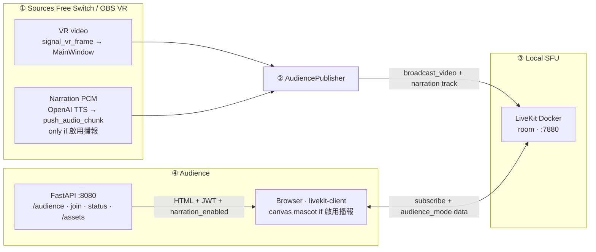
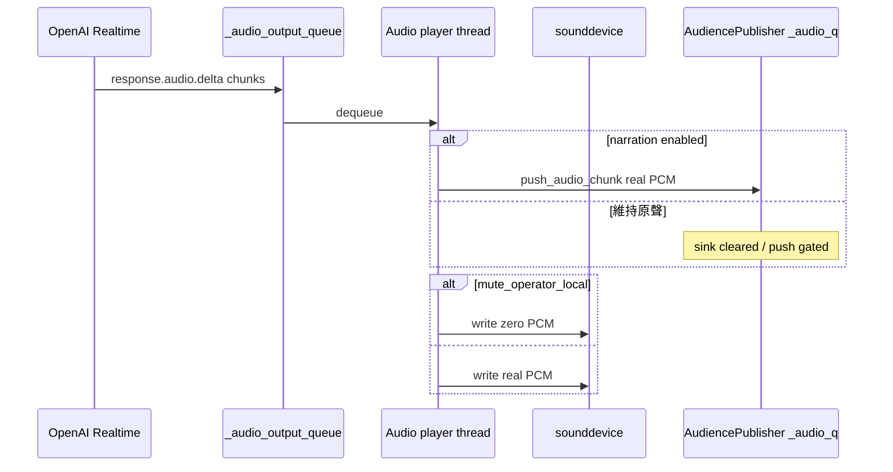

# Audience second screen (LiveKit)

This package implements a **second display** for viewers: they open a browser page and receive **VR video** (LiveKit track `broadcast_video`) over WebRTC. Optionally they also receive **AI TTS** (`narration`) and a **browser-side mascot** overlay.

| Topic | Behavior |
|-------|----------|
| **Video** | Native-resolution VR from Free Switch or pure OBS via `signal_vr_frame` (typically **1920×1080**) |
| **Audio** | Only when GUI **Audience** = **啟用播報**: OpenAI TTS PCM → `push_audio_chunk` → LiveKit `narration` |
| **Mascot** | Viewer-only canvas chroma (`static/index.html` + `/assets/avatar/…`). Shown only when **啟用播報**; hidden in **維持原聲** |
| **Operator GUI** | Continues to preview the selected Free Switch / OBS source |

`AudiencePublisher` never burns the mascot into `broadcast_video`. Higher video resolution increases encode bandwidth and CPU/GPU load on the publisher machine.

Integration: [gui.py](../gui.py) (`_ensure_audience_token_server`, `_start_audience_services`, `_on_audience_mode_changed`, `_deliver_audience_vr_frame`). Frame contracts: [workers/README.md](../workers/README.md).

---

## Audience modes (GUI dropdown)

| Mode | Viewers get | Operator UI |
|------|-------------|-------------|
| **啟用播報 (AI 語音)** | VR video + AI `narration` + cat mascot | Style / Voice / Language / Speed visible (as usual for the selected TTS) |
| **維持原聲 (僅畫面)** | VR video only — no AI audio, no mascot | Style / Voice / Language / Speed (and Local Exaggeration/CFG) **hidden** |

Notes:

- Switching modes mid-session updates viewers live (LiveKit data topic `audience_mode` + HTTP status poll).
- **維持原聲 does not require Start Broadcasting** — open Free Switch or VR, wait for `[MEDIA] connected`, viewers see video.
- **Start Broadcasting** starts the AI pipeline (LiveCC → Gemini → TTS). Audience hears that TTS only in **啟用播報** with **OpenAI TTS**.
- Publisher refuses further PCM when narration is off (`push_audio_chunk` gated + queue flushed). The browser also detaches `narration` audio elements so leftover WebRTC audio cannot play.

---

## When it runs

| Condition | Behavior |
|-----------|----------|
| `audience.enabled: true` in [configs/app.yml](../../../configs/app.yml) | HTTP token server starts with the GUI (`GET /audience`, `POST /api/audience/join`, `GET /api/audience/status`, `/assets/*`). |
| Operator opens **Free Switch** or **VR (OBS Virtual Camera)** | LiveKit publisher starts: always publishes `broadcast_video`; `narration` track is published but only receives PCM when **啟用播報** + OpenAI TTS sink is registered. |
| Operator leaves those modes | Publisher stops; HTTP server keeps running until the app exits. |
| TTS = **Mute** or **Local TTS** | No PCM sink → no AI audio on audience even in **啟用播報**. |
| `audience.mute_operator_local: true` | While the PCM sink is active, the operator speaker is silenced (zero PCM locally) so timing stays aligned without double audio. |

---

## End-to-end flow

**Mode sync to viewers**

1. `POST /api/audience/join` returns `narration_enabled` with the JWT.
2. Publisher sends LiveKit data packets on topic `audience_mode` (`{"type":"audience_mode","narration_enabled":bool}`).
3. Viewer polls `GET /api/audience/status` every ~2 s as a fallback.

**CPU / threading (publisher):** OpenCV resize / RGBA pack for VR run on `_vr_executor` (`ThreadPoolExecutor`, 2 workers). Mascot chroma runs only in the browser.

---

## Browser mascot overlay (`static/index.html`)

| Item | Detail |
|------|--------|
| **Visibility** | Shown only when `narration_enabled` is true and avatar assets exist (`window._AVATAR_ENABLED`). |
| **Video source** | `/assets/avatar/cat_anchor.mp4` (flat backdrop recommended). |
| **Keying** | Canvas chroma from border-band backdrop estimate; optional `overlay_config.json`. |
| **Mouth** | Optional PNG opacity follows RMS on the `narration` track (`AnalyserNode`). |
| **Audio** | When **維持原聲**, all narration `<audio>` elements are detached; new audio tracks are ignored until mode returns to **啟用播報**. |

There is **no** server-side Python mascot composite into `broadcast_video`.

---

## TTS path (啟用播報 only)

PCM flows through OpenAI TTS `_audio_output_queue`. The player forwards each chunk to `push_audio_chunk` and, when `mute_operator_local` is true, writes **silence** to the local device so pacing matches unmuted playback.

---

## Components

| Path | Role |
|------|------|
| [token_server.py](token_server.py) | FastAPI: viewer HTML, JWTs, `/assets/*`, `narration_enabled` on join + `/api/audience/status`. |
| [static/index.html](static/index.html) | LiveKit viewer; mode-aware mascot + audio attach/detach. |
| [livekit_publisher.py](livekit_publisher.py) | Publishes `broadcast_video` + `narration`; gates PCM; publishes `audience_mode` data. |
| [gui.py](../gui.py) | Audience dropdown, control visibility, PCM sink register/clear, starts publisher on Free Switch / OBS. |
| [openai_tts.py](../core/models/openai_tts.py) | `register_pcm_sink` + `flush_callback` for LiveKit backlog. |
| [workers/free_switch.py](../workers/free_switch.py) / [workers/obs_input.py](../workers/obs_input.py) | Emit `signal_vr_frame` for audience video. |
| [docker-compose.yml](../../../docker-compose.yml) / [livekit.yaml](../../../livekit.yaml) | Local LiveKit. |
| [scripts/open-audience-firewall.ps1](../../../scripts/open-audience-firewall.ps1) | Windows firewall for LAN viewers. |

---

## Setup (local)

1. **LiveKit** (repo root): `docker compose up -d`
2. Align LAN IP in `configs/app.yml` → `audience.livekit_url` and `docker-compose.yml` → `--node-ip`
3. Firewall: run `scripts/open-audience-firewall.ps1` as Administrator if needed
4. GUI: `python -m miis_broadcast`
5. Operator: Free Switch or VR → wait for **`[MEDIA] connected`** → viewers open `http://<host>:8080/audience`
6. Choose **啟用播報** or **維持原聲**; hard-refresh the viewer page after pulling HTML/JS changes

---

## Configuration ([configs/app.yml](../../../configs/app.yml))

| Key | Meaning |
|-----|---------|
| `audience.enabled` | Master switch |
| `audience.livekit_url` | WebSocket URL for the browser |
| `audience.api_key` / `api_secret` | Must match `livekit.yaml` |
| `audience.room` | Shared room name |
| `audience.port` | HTTP port for `/audience`, join, status, `/assets/*` (default **8080**) |
| `audience.mute_operator_local` | Silence operator speaker while PCM sinks to LiveKit |

Audience **mode** (啟用播報 / 維持原聲) is a **GUI** setting, not a YAML key.

---

## Client terminal log reference

### `[AUDIENCE]` — HTTP token server / mode notify

| Example | Meaning |
|---------|---------|
| `[AUDIENCE] token server started → http://localhost:8080/audience` | Uvicorn bound |
| `[AUDIENCE] join id=… room=…` | Viewer joined; JWT issued |
| `[AUDIENCE] mode notify narration_enabled=False` | Publisher told viewers to hide mascot / stop AI audio |
| `[ERR] [AUDIENCE] token server bind failed …` | Port in use |

### `[MEDIA]` — video publisher

| Example | Meaning |
|---------|---------|
| `[MEDIA] connected \| room=…` | Room connected |
| `[MEDIA] publish_start track=broadcast_video (vr mode)` | Video track up |
| `[MEDIA] fps=29.0 drop=0` | Video pump stats |
| `[MEDIA] publisher stopped` | Teardown complete |

### `[AUDIO]` — narration track + PCM sink

| Example | Meaning |
|---------|---------|
| `[AUDIO] publish_start track=narration (vr mode)` | Audio track published (may stay silent in 維持原聲) |
| `[AUDIO] PCM sink registered \| mute_local=…` | TTS→LiveKit sink active (**啟用播報**) |
| `[AUDIO] PCM sink cleared \| mute_local=False` | Sink removed (**維持原聲** or teardown) |
| `[AUDIO] chunks/s=… aq=…` | Audio pump stats while PCM is flowing |

### `[SESSION AVG]` — on Stop Broadcasting

| Example | Meaning |
|---------|---------|
| `[SESSION AVG] [MEDIA] …` | Mean video pump stats for the session |
| `[SESSION AVG] [AUDIO] …` | Mean narration pump stats for the session |

---

## Troubleshooting

| Symptom | Check |
|---------|--------|
| Still hear AI after **維持原聲** | Hard-refresh `/audience` (Ctrl+F5); confirm log shows `PCM sink cleared` and/or `mode notify narration_enabled=False` |
| Cat still visible after **維持原聲** | Same hard-refresh; check join/status `narration_enabled` |
| No video | Free Switch or VR open? `[MEDIA] connected`? `audience.enabled`? |
| No AI audio in **啟用播報** | TTS = **OpenAI TTS**; pressed **Start**; sink registered |
| Style/Voice hidden | Expected in **維持原聲** — switch back to **啟用播報** |
| Phone cannot connect | LAN IP in `livekit_url` + `--node-ip`, firewall |
| Port 8080 refused | GUI running with `audience.enabled: true` |

---

## See also

- Root overview: [README.md](../../../README.md)
- Input workers / `signal_vr_frame`: [workers/README.md](../workers/README.md)
