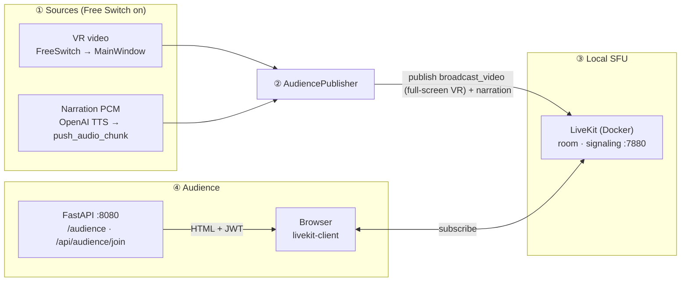
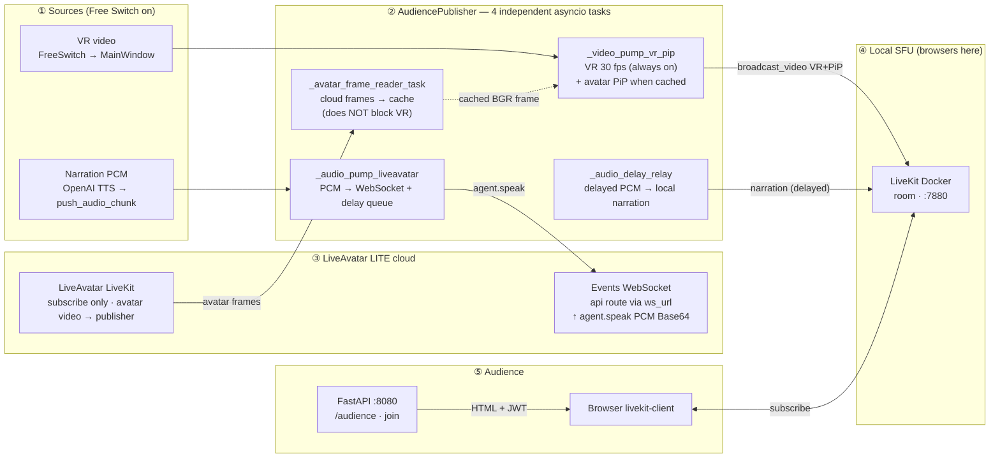
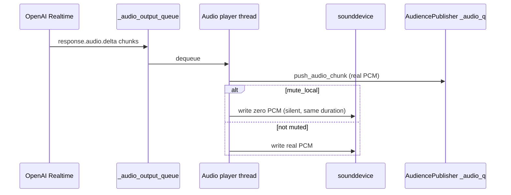
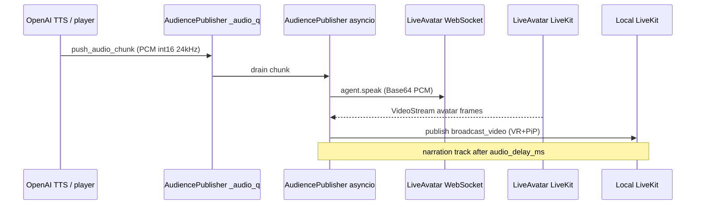

# Audience second screen (LiveKit)

This package implements a **second display** for viewers: they open a browser page and receive **video** (one LiveKit track: `broadcast_video`) plus **TTS narration** (`narration`) over WebRTC (LiveKit). **Same track name in both modes; only the pixel content changes** (full-screen VR vs VR + LiveAvatar PiP). The **control GUI (first screen)** continues to show whichever source the operator selects in **Free Switch**; **no narration is meant to play on the first screen** when the audience pipeline is active (`mute_local=True`).

Two operating modes are supported (toggled by `configs/app.yml`):

| Mode | Video source | Audio path |
|------|-------------|------------|
| **VR mode** (default, `liveavatar.enabled: false`) | VR camera frames from `FreeSwitchCameraThread` | TTS PCM → local room directly |
| **LiveAvatar mode** (`liveavatar.enabled: true`) | VR full screen + LiveAvatar avatar as **picture-in-picture** (bottom-right, optional) | TTS PCM → LiveAvatar **WebSocket** (`agent.speak`) **and** local room (delayed ~300 ms for A/V sync) |

Full integration points live in [gui.py](../gui.py) (`_ensure_audience_token_server`, `_start_audience_services`, `_deliver_audience_vr_frame`). For input workers and frame contracts, see [workers/README.md](../workers/README.md).

---

## When it runs

| Condition | Behavior |
|-----------|----------|
| `audience.enabled: true` in [configs/app.yml](../../../configs/app.yml) | HTTP token server may start with the GUI (`GET /audience`, `POST /api/audience/join`). |
| Operator chooses **Online ▾ → Free Switch** | **LiveKit publisher** starts: publishes `broadcast_video` + `narration` (pixels: VR-only vs VR+LiveAvatar PiP per `liveavatar.enabled`). |
| Operator leaves Free Switch / switches mode | Publisher stops; HTTP server keeps running until the app exits (if enabled). |

---

## End-to-end flow

**At a glance — how the two modes differ**

| Topic | **VR mode** (`liveavatar.enabled: false`) | **LiveAvatar mode** (`liveavatar.enabled: true`) |
|------|--------------------------------------|------------------------------------------|
| **Prerequisite** | **Free Switch** must be on | Same |
| **What viewers see** | Full-screen VR only | Full-screen VR + **bottom-right avatar (PiP)** |
| **Narration audio** | Straight to **local** LiveKit | **WebSocket** to LiveAvatar (`agent.speak`); **~300 ms delayed** path to **local** LiveKit (A/V alignment) |
| **How viewers join** | Same for both: `http://…:8080/audience` → JWT → WebRTC to **local** LiveKit | Same |

The LiveAvatar diagram below splits **control-plane** (REST, once per run) from **media**: **WebSocket** carries narration PCM (`agent.speak`); **LiveAvatar LiveKit** carries the rendered avatar video back. Local Docker LiveKit is unchanged for the browser.

> **VR is fully independent of the avatar cloud stream.**
> `_video_pump_vr_pip` runs at a fixed **30 fps** from the moment Free Switch starts, regardless of whether the avatar track has arrived.  The avatar PiP is overlaid only when a cached frame is available; if the cloud stalls the VR output continues uninterrupted.  The four tasks below run in parallel with no shared blocking dependency.

---

### VR mode (narration + full-screen VR)



---

### LiveAvatar mode (VR background + avatar PiP + narration)

**Bootstrap (once when publisher starts):** `POST https://api.liveavatar.com/v1/sessions/token` → `POST …/v1/sessions/start` (Bearer) → receive `livekit_url`, `livekit_client_token`, `ws_url`; connect WebSocket and wait `session.state_updated: connected`.



**LiveAvatar mode — tasks (match ② above)**

| Task | Starts | Depends on cloud? | What it does |
|--|--|--|--|
| `_video_pump_vr_pip` | Immediately | **No** | VR at fixed 30 fps; overlays PiP from cache if available |
| `_avatar_frame_reader_task` | Immediately | Yes (up to 30 s wait) | Reads cloud avatar frames, updates `_liveavatar_last_avatar_bgr` only |
| `_audio_pump_liveavatar` | Immediately | No | Drains TTS PCM → WebSocket `agent.speak` + delay queue |
| `_audio_delay_relay` | Immediately | No | Forwards delayed PCM → local `narration` AudioSource |

**LiveAvatar mode — steps (match numbered bands above)**

| Step | Who | What happens |
|:--:|--|--|
| ① | GUI + TTS | Free Switch feeds VR; TTS feeds PCM into `AudiencePublisher` |
| ② | `AudiencePublisher` | Four tasks start in parallel; VR publishing never waits for avatar; PiP appears once first cloud frame is cached |
| ③ | LiveAvatar | **WebSocket** ingests PCM for lip sync; **cloud LiveKit** delivers avatar video to `_avatar_frame_reader_task` |
| ④ | Local LiveKit | Receives `broadcast_video` (VR or VR+PiP) + delayed `narration` |
| ⑤ | Audience | Same as VR: :8080 → JWT → subscribe **local** room |

### TTS path (why it matches first-screen timing)

PCM still flows through a **single** `_audio_output_queue`. The player thread forwards each chunk to `push_audio_chunk` **and**, when `mute_local=True`, feeds **silence** to the local audio device so **hardware playback timing** stays aligned with unmuted mode. That keeps the LiveKit audio stream paced like normal local playback (see [openai_tts.py](../core/models/openai_tts.py)).



**LiveAvatar mode:** the same `push_audio_chunk` traffic is also consumed inside `AudiencePublisher` → WebSocket `agent.speak` (see flowchart above). Local `narration` is intentionally **delayed** (~300 ms) for lip sync.



---

## Components

| Path | Role |
|------|------|
| [token_server.py](token_server.py) | FastAPI + uvicorn on `0.0.0.0`; serves viewer HTML and short-lived subscribe-only JWTs. |
| [static/index.html](static/index.html) | LiveKit JS viewer: subscribes to published video + audio tracks (`broadcast_video`, `narration`). |
| [livekit_publisher.py](livekit_publisher.py) | Background asyncio thread: VR mode or LiveAvatar dual-room + WebSocket PCM; audio delay relay. |
| [liveavatar_session.py](liveavatar_session.py) | LiveAvatar LITE: token/start REST, WebSocket `agent.speak` / `agent.interrupt`, session stop. |
| [gui.py](../gui.py) | Reads `liveavatar` config block, builds dict, passes `liveavatar_cfg` to `AudiencePublisher`. |
| [openai_tts.py](../core/models/openai_tts.py) | `register_pcm_sink`, `clear_audio_queue` + optional `flush_callback` for LiveKit backlog. |
| [workers/free_switch.py](../workers/free_switch.py) | Emits **`signal_vr_frame`** (always VR) alongside **`signal_frame`** (active source). |
| [docker-compose.yml](../../../docker-compose.yml) | Local LiveKit container; map signaling + UDP ports. |
| [livekit.yaml](../../../livekit.yaml) | LiveKit server config (keys, RTC port range). |
| [scripts/open-audience-firewall.ps1](../../../scripts/open-audience-firewall.ps1) | Windows inbound rules for LAN viewers (run elevated). |

---

## Setup (local)

1. **LiveKit** (from repo root):

   ```bash
   docker compose up -d
   ```

2. **Align URLs for your LAN** (same host in all three places):

   - `configs/app.yml` → `audience.livekit_url` (e.g. `ws://<PC_LAN_IP>:7880`)
   - `docker-compose.yml` → `--node-ip <PC_LAN_IP>` (ICE must advertise a reachable IP)
   - Optional: pass `lan_hint_host=` into `AudienceTokenServer` from config if your `gui.py` is wired for it (prints a same-Wi-Fi URL in the console).

3. **Firewall** (other devices on Wi‑Fi): run `scripts/open-audience-firewall.ps1` **as Administrator** once, or manually allow TCP **8080, 7880, 7881** and UDP **50000–50020**.

4. **GUI**:

   ```bash
   python -m miis_broadcast
   ```

5. **Operator**: **Free Switch** → wait for `[MEDIA] connected` in the terminal → viewers open `http://<PC_LAN_IP>:8080/audience` (or `localhost` on the same machine).

---

## Configuration reference ([configs/app.yml](../../../configs/app.yml))

### `audience` section

| Key | Meaning |
|-----|---------|
| `audience.enabled` | Master switch for the feature. |
| `audience.livekit_url` | WebSocket URL passed to the browser (`ws://…:7880`). |
| `audience.api_key` / `api_secret` | Must match `livekit.yaml` `keys` (secret ≥ 32 chars on recent LiveKit). |
| `audience.room` | LiveKit room name (publisher + viewers join the same room). |
| `audience.port` | HTTP port for `/audience` and `/api/audience/join` (default **8080**). |

### LiveAvatar secrets (`.env`)

Keep **`LIVEAVATAR_API_KEY`** (and optionally **`LIVEAVATAR_AVATAR_ID`**, **`LIVEAVATAR_VOICE_ID`**) in the project root **`.env`** (gitignored). With `liveavatar.enabled: true` in `app.yml`, the GUI reads the key from the environment first, then falls back to `liveavatar.api_key` in YAML if set.

### `liveavatar` section

| Key | Default | Meaning |
|-----|---------|---------|
| `liveavatar.enabled` | `false` | Set `true` to activate LiveAvatar avatar PiP mode. |
| `liveavatar.api_key` | `""` | Optional if **`LIVEAVATAR_API_KEY`** is set in `.env`. Otherwise use API key from [app.liveavatar.com/developers](https://app.liveavatar.com/developers). |
| `liveavatar.avatar_id` | `""` | Avatar UUID from LiveAvatar, or **`LIVEAVATAR_AVATAR_ID`** in `.env`. |
| `liveavatar.voice_id` | `""` | Optional; **`LIVEAVATAR_VOICE_ID`** in `.env` (reserved for future use; LITE uses avatar default voice). |
| `liveavatar.quality` | `"medium"` | Video quality: `"low"` / `"medium"` / `"high"`. |
| `liveavatar.audio_delay_ms` | `300` | Delay (ms) added to local-audience audio to align with cloud video latency. |
| `liveavatar.sandbox` | `false` | When `true`, token requests use `is_sandbox` (see LiveAvatar docs). |

> **Network requirements (LiveAvatar mode)**
> - Docker host must reach **HTTPS 443** (`api.liveavatar.com`, WebSocket) and **UDP high ports** (LiveAvatar cloud LiveKit).
> - Install `httpx` and `websockets`: `pip install httpx websockets`.
> - Windows Firewall: run `scripts/open-audience-firewall.ps1` as Administrator.

---

## Client terminal log reference (prefixes)

These lines appear on **`python -m miis_broadcast`** stdout (not the browser). They are **separate** from session files under `logs/sessions/` and from server `[Server]` / `[Client]` telemetry in remote inference.

### `[AUDIENCE]` — HTTP token server

| Example | Meaning |
|---------|---------|
| `[AUDIENCE] token server started → http://localhost:8080/audience` | Uvicorn bound; local viewer URL. |
| `[AUDIENCE] same-WiFi URL → http://…:8080/audience` | Printed when a LAN hint host is configured. |
| `[AUDIENCE] if other devices cannot open…` | Reminder about Windows firewall. |
| `[AUDIENCE] join id=audience-… room=broadcast-room` | A viewer called `POST /api/audience/join`; JWT issued. |
| `[AUDIENCE] token server stopped` | App shutdown or server torn down. |
| `[ERR] [AUDIENCE] token server bind failed …` | Port in use or permission issue. |

### `[MEDIA]` — LiveKit publisher (video + session)

| Example | Meaning |
|---------|---------|
| `[MEDIA] publisher starting \| room=… mode=vr` | `AudiencePublisher.start()` in VR mode. |
| `[MEDIA] publisher starting \| room=… mode=liveavatar` | `AudiencePublisher.start()` in LiveAvatar mode. |
| `[MEDIA] connected \| room=…` | Local room connected. |
| `[MEDIA] local_room connected \| room=…` | LiveAvatar mode: local room connected. |
| `[MEDIA] publish_start track=broadcast_video (vr mode)` | VR-only pixels on the shared video track name. |
| `[MEDIA] publish_start track=broadcast_video (liveavatar mode)` | VR + PiP composite on the same track name. |
| `[MEDIA] fps=29.0 drop=0 (vr)` | VR pump stats; `drop` = backpressure. |
| `[MEDIA] fps=29.0 (pip) vr_q=…` | LiveAvatar mode; avatar PiP overlay active; `vr_q` = pending VR queue depth. |
| `[MEDIA] fps=29.0 (vr-only) vr_q=…` | LiveAvatar mode; avatar cache empty (cloud not ready / stalled); VR published without PiP. |
| `[MEDIA] disconnected from LiveKit` | Clean disconnect. |
| `[MEDIA] publisher stopped` | Thread joined after `stop()`. |
| `[WARN] [MEDIA] publisher thread hung; forcing event loop stop` | Graceful shutdown timed out. |
| `[ERR] publisher session (vr/liveavatar): …` | Python-side failure. |

### `[LIVEAVATAR]` — LiveAvatar session lifecycle

| Example | Meaning |
|---------|---------|
| `[LIVEAVATAR] creating token \| avatar=…` | POST `/v1/sessions/token` in progress. |
| `[LIVEAVATAR] session token created` | Token OK; about to start session. |
| `[LIVEAVATAR] session started \| session_id=… livekit=…` | POST `/v1/sessions/start` + WebSocket ready. |
| `[LIVEAVATAR] avatar_room connected \| url=…` | Connected to cloud LiveKit (video subscribe). |
| `[LIVEAVATAR] avatar video track subscribed \| participant=…` | Cloud avatar video track received; frame reader starts decoding. |
| `[LIVEAVATAR] avatar frame reader started` | Frame decode loop active; PiP will appear on next compositor tick. |
| `[WARN] [LIVEAVATAR] avatar frame not received in 30s; PiP disabled` | Cloud track never arrived; VR continues without PiP. |
| `[LIVEAVATAR] interrupt sent` | WebSocket `agent.interrupt` (TTS preempted). |
| `[LIVEAVATAR] silence chunk sent (100 ms)` | Short silence after interrupt / flush. |
| `[LIVEAVATAR] session stopped \| session_id=…` | POST `/v1/sessions/stop` on clean shutdown. |
| `[WARN] [LIVEAVATAR] avatar video track not received in 30s; PiP disabled` | No video from cloud; VR continues; check API key / network. |
| `[ERR] [LIVEAVATAR] failed to start session: …` | REST or WebSocket error; check `LIVEAVATAR_API_KEY` / `avatar_id`. |

### `[AUDIO]` — publisher narration track + PCM hook

| Example | Meaning |
|---------|---------|
| `[AUDIO] publish_start track=narration` | LiveKit audio track published. |
| `[AUDIO] chunks/s=4.0 sample_rate≈24000 drop=8` | Periodic audio pump stats; `drop` = `_audio_q` depth / drops; rate should stay near **24000** samples/s when speech is active. |
| `[AUDIO] PCM sink registered \| mute_local=True` | From [openai_tts.py](../core/models/openai_tts.py) when Free Switch registers the audience sink. |
| `[AUDIO] PCM sink cleared \| mute_local=False` | Publisher stopped / sink removed. |

### LiveKit **server** (Docker logs)

Rust lines such as `failed to negotiate the publisher` may appear in **`docker compose logs`** during bad ICE / reconnect races; they are **not** the Python `[MEDIA]` prefixes above. Correlate with publisher start/stop on the client.

---

## Troubleshooting (short)

| Symptom | Check |
|---------|--------|
| `ERR_CONNECTION_REFUSED` on `:8080` | GUI not running or `audience.enabled: false`. |
| `ERR_CONNECTION_REFUSED` on `:7880` | `docker compose up -d` and firewall. |
| Phone cannot connect | Same Wi‑Fi, correct LAN IP in `livekit_url` + `--node-ip`, firewall script. |
| Overlapping audio in browser | Ensure a single `narration` element (see `index.html` dedupe by track name); avoid duplicate tabs both unmuted in the same room. |
| `[AUDIO] … drop=` always high | CPU/network; see queue sizing in `livekit_publisher.py`. |

---

## See also

- Root project overview: [README.md](../../../README.md)
- Input workers and `signal_vr_frame`: [workers/README.md](../workers/README.md)
